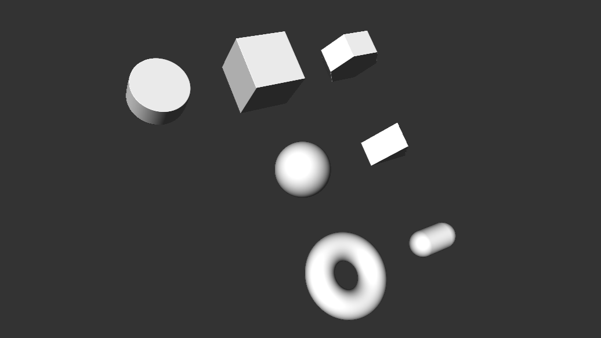

# hiccup-sdf

Monorepository holding tools for modeling with signed distance functions using hiccup-like language, works both on CPU and GPU.
Provides multiple primitives, basic operations, and custom `map` function for working over large amounts of data efficiently.

  

## Projects

Each project contains detailed README file.

- [`hiccup-sdf`](./packages/hiccup-sdf) - main library
- [`display-sdf`](./packages/display-sdf) - utility for displaying SDFs
- [`hiccup-sdf-to-obj`](./packages/hiccup-sdf-to-obj) - utility for exporting `hiccup-sdf` models to OBJs

## Examples

- [`basic`](./examples/basic) - example usage of `hiccup-sdf` and `display-sdf`
- [`obj-export`](./examples/obj-export) - examples of exporting `hiccup-sdf` models to OBJs

## Future Work

PRs welcome!

- [ ] consistent `map` function for CPU and GPU
- [ ] threaded meshing for model trees containing functions
- [ ] support for custom user-defined functions

## Acknowledgements

This project was developed in part at Laboratory, an artist residency for interactive arts: [https://laboratoryspokane.com](https://laboratoryspokane.com).

