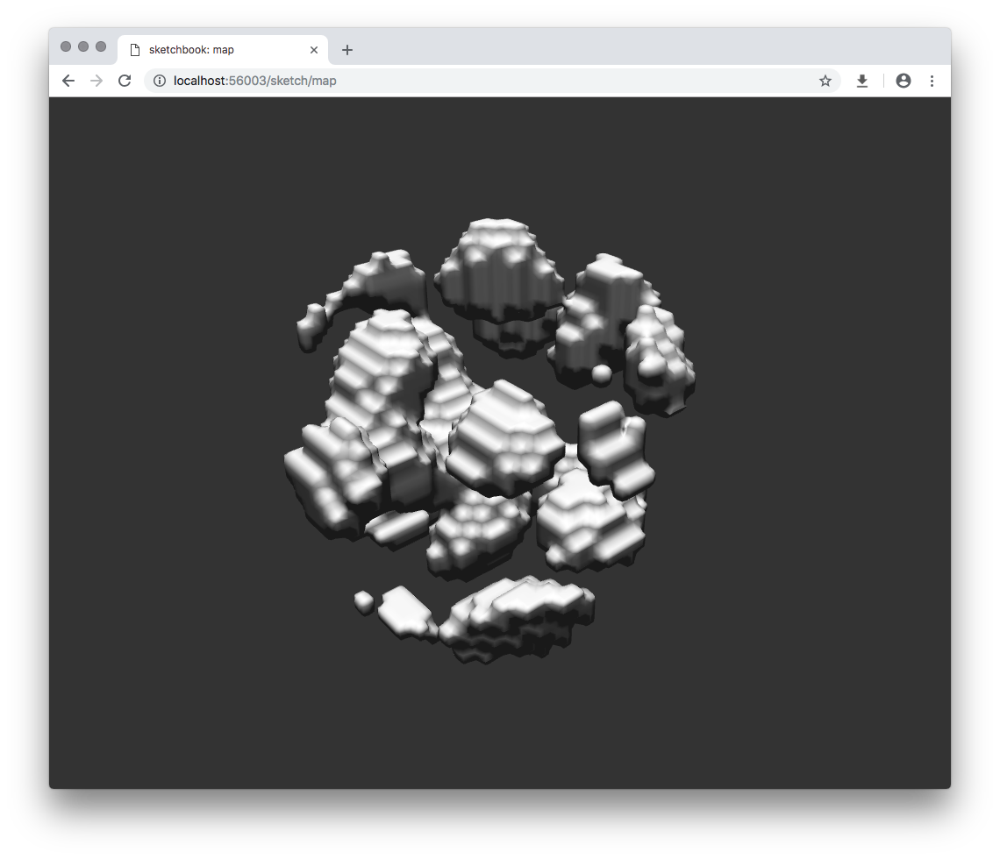

# display-sdf

Helper library for displaying SDFs, supports rendering "straight" from GPU, or meshing with surface-nets and displaying as a mesh.

<p align="center">
  
</p>

## Installation

`npm install display-sdf --save`

## Basic Usage

```js
const { displayRaw } = require("display-sdf");

// generate shaderCode

displayRaw(shaderCode);
```

In combination with `hiccup-sdf`:

```js
const { displayRaw } = require("display-sdf");
const { compileShader, glslHelpers } = require("hiccup-sdf");

const tree = ["box"]

const { inject, model } = compileShader(tree);
const shader = glslHelpers.createShaderFull(model, inject);

displayRaw(shader);
```

## Meshing

Sometimes working with "straight" GPU rendering is not ideal, so `display-sdf` provides an option to mesh the SDF using surface-nets, and display afterwards:

```js
const { displayRaw } = require("display-sdf");

// generate shaderCode

displayMesh(shader, { size: 128 });
```

## Usage

All options are optional.

### `displayRaw(shaderCode, options)`

- `shaderCode` - stringified SDF GLSL code
- `options.textures` - custom data textures to pass to the shader, used by `hiccup-sdf` `map` function to work over large amounts of data

### `displayMesh(shaderCode, options)`

- `shaderCode` - stringified SDF GLSL code
- `options.size` - size of the surface-nets field (uniform box, so `128` becomes `[128, 128, 128]`)
- `options.textures` - custom data textures to pass to the shader, used by `hiccup-sdf` `map` function to work over large amounts of data
- `options.refine` - should [`refine-mesh`](https://github.com/mikolalysenko/refine-mesh) be executed after meshing, this usually makes the output look nicer (`true`/`false`)
- `options.refineOptions` - [custom options to pass to `refine-mesh`](https://github.com/mikolalysenko/refine-mesh#api)

## Acknowledgements

This project was developed in part at Laboratory, an artist residency for interactive arts: [https://laboratoryspokane.com](https://laboratoryspokane.com).

