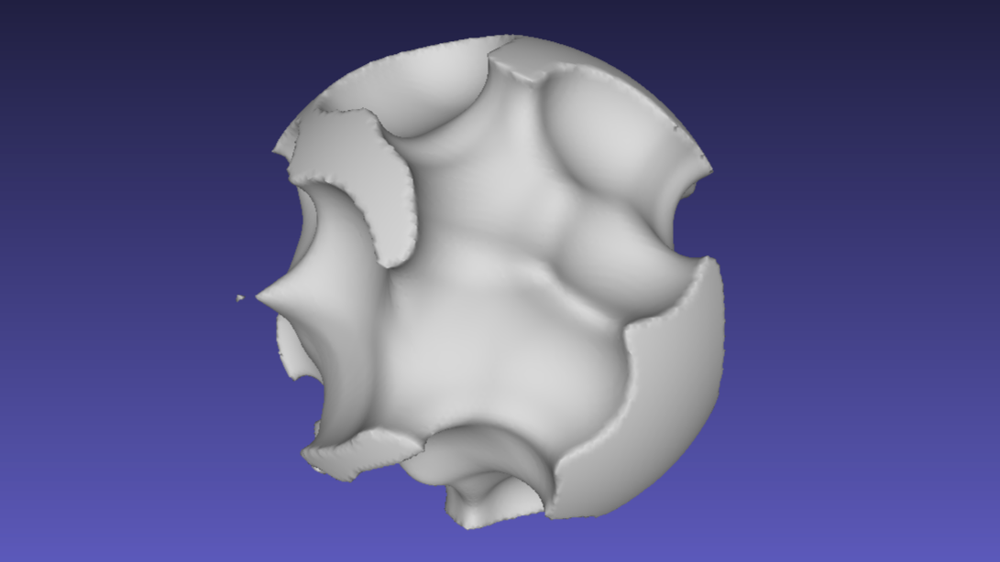

# hiccup-sdf-to-obj

Tools for exporting `hiccup-sdf` models to OBJs. Supports single CPU, threaded CPU and GPU mashing. Designed for offline export in node.js.

<p align="center">
  
</p>

## Installation

`npm install hiccup-sdf-to-obj --save`

## Usage

### CPU meshing

```js
const fs = require("fs")
const sdfToObj = require("hiccup-sdf-to-obj")

const tree = ["sphere"];

sdfToObj(tree, obj => {
  fs.writeFileSync(path.join(__dirname, "sphere.obj"), obj);
});
```

`$ node export-obj.js`

### Threaded CPU meshing

Uses [worker threads](https://nodejs.org/api/worker_threads.html):

```js
const fs = require("fs")
const sdfToObj = require("hiccup-sdf-to-obj/threaded")

const tree = ["sphere"];

sdfToObj(tree, obj => {
  fs.writeFileSync(path.join(__dirname, "sphere.obj"), obj);
});
```

`$ node --experimental-worker export-obj.js`

**Warning:** currently `map` from `hiccup-sdf` is not supported in threaded export!

### GPU meshing

Uses offscreen Electron to render on GPU and mesh to OBJ.

```js
const fs = require("fs")
const sdfToObj = require("hiccup-sdf-to-obj/gpu")

const tree = ["sphere"];

sdfToObj(tree, obj => {
  fs.writeFileSync(path.join(__dirname, "sphere.obj"), obj);
});
```

`$ node export-obj.js`

## API

All options are optional.

### `sdfToObj(tree, [options], callback)`

- `tree` - `hiccup-sdf` model tree
- `options.size` - resolution for meshing, `128` is the default, for GPU meshing `256` usually gives nicer results, for single CPU `64` is recommended for speed (but ugly exports)
- `options.threads` - number of threads to spawn, works only with `threaded` exports, defaults to `4`
- `callback(obj)` - callback called with obj string if succeeded, otherwise `null`

## Acknowledgements

This project was developed in part at Laboratory, an artist residency for interactive arts: [https://laboratoryspokane.com](https://laboratoryspokane.com).

