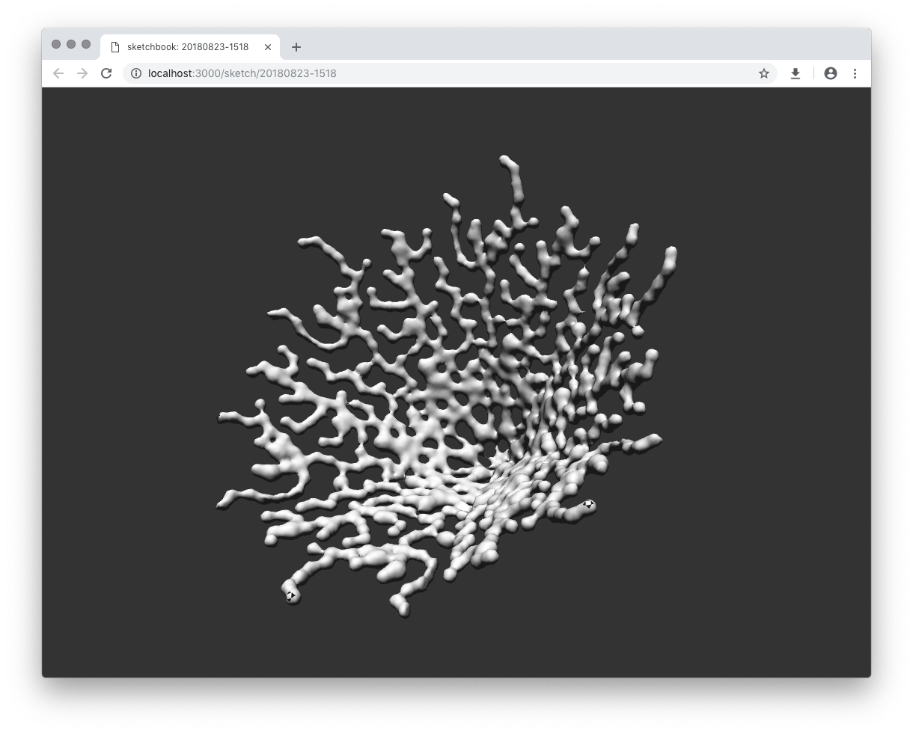

# hiccup-sdf

Library for building signed distance function models using hiccup-like language.

<p align="center">
  
</p>

## Installation

`npm install hiccup-sdf --save`

## Basic usage

```js
const { displayRaw } = require("display-sdf");
const { compileShader, glslHelpers } = require("hiccup-sdf");

const tree = [
  "difference",
  [
    ["box", { s: [0.5, 0.5, 0.5] }],
    ["sphere", { r: 0.4 }]
  ]
];

const { inject, model } = compileShader(tree);
const shader = glslHelpers.createShaderFull(model, inject);

displayRaw(shader);
```

## Language

### Shapes

- `["sphere", { r: float }]`
- `["box", { s: [float, float, float] }]`
- `["torus", { r1: float, r2: float }]`
- `["hex", { h: float, r: float }]`
- `["triangle", { h: float, r: float }]`
- `["capsule", { a: float, b: float, r: float }]`
- `["cylinder", { h: float, r: float }]`

### Operations

- `["translate", { t: [float, float, float] }, [subtree]]`
- `["scale", { s: float }, [subtree]]`
- `["rotate", { r: [float, float, float] }, [subtree]]`
- `["mirror", { m: [float, float, float] }, [subtree]]`
- `["repeat", { r: [float, float, float] }, [subtree]]`
- `["repeatPolar", { r: float }, [subtree]]`
- `["union", { r: float }, [subtree]]`
- `["intersection", { r: float }, [subtree]]`
- `["difference", { r: float }, [subtree]]`
- `["blend", { k: float }, [subtree]]`

### `Map`

Map is bit more complex operation allowing map-reduce style mapping over huge datasets. This works around instruction/complexity limitations for GPU shaders, and provides nicer API to work with. Unfortunately there are some differences in `map` usage on CPU/GPU (all the other functions/operations should work the same regardless of the backend).

```js
const randomPositions = range(1000).map(() => randomPosition()); // random array of [x,y,z] positions

const tree = [
  "map",
  {
    // data points to map over, an object mapping key to value, multiple datasets can be supplied
    data: { position: randomPositions },

    // mapping function, runs for each of the data points, `props` contains a single data point for each of `data` keys
    map: props => [
      "translate",
      {
        t: `${props.position}.xyz` // fragment of GLSL code that will be injected when mapping over the texture when ran on GPU, if used on CPU this should be `{ t: props.position }` as we can use the js array directly
      },
      [
        ["sphere", { r: 0.1 }]
      ]
    ],

    // reducing function, generated subtree will be inserted as last parameter,
    // usually `union` / `interesction` / `difference`
    reduce: ["union", { r: 0.02 }]
  }
]
```

When ran on GPU this operation is turned into efficient texture traversal, and `compileShader()` returns `uniforms` with matching textures.
For full example open [`examples/basic/map.js`](../../examples/basic/map.js).

## Public API

### `const dsl = require("hiccup-sdf")`

- `dsl.compileShader(tree)` - generates SDF shader, returns an object: `{ model, uniforms, inject }`:
  - `model` - modeling part of SDF shader on GPU
  - `inject` -  SDF shader code necessary to run the modeling shader
  - `uniforms` - data values if the tree is using `map` function
- `dsl.compileFunction(tree)` - generate SDF function to be used on CPU, returns a function:
  - `fn([x, y, z])` - returns SDF value for given point

- `dsl.glslHelpers` - helper utils for generating GLSL code:
  - `dsl.glslHelpers.createShaderFull(model, inject)` - creates full SDF shader that can be used without any modifications
  - `dsl.glslHelpers.createShaderModel(model, inject)` - creates only the `vec2 doModel(vec3 p)` part of the shader

## Acknowledgements

This project was developed in part at Laboratory, an artist residency for interactive arts: [https://laboratoryspokane.com](https://laboratoryspokane.com).

